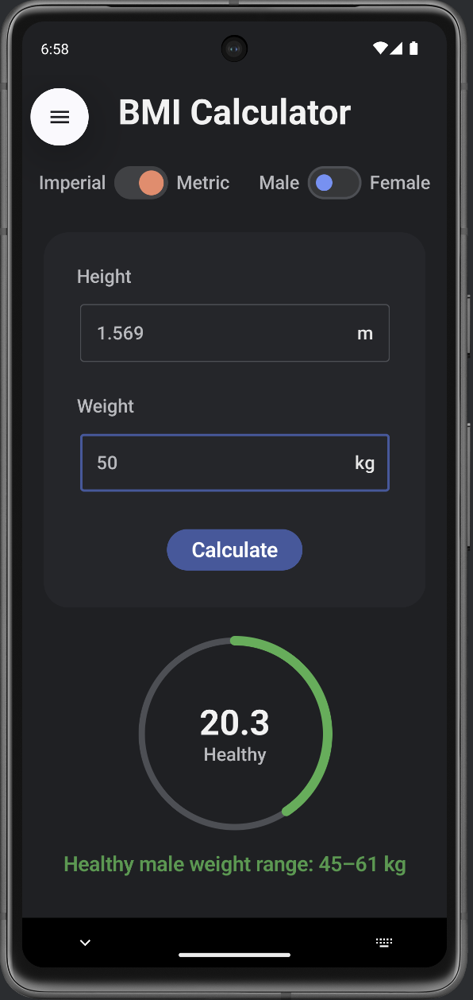
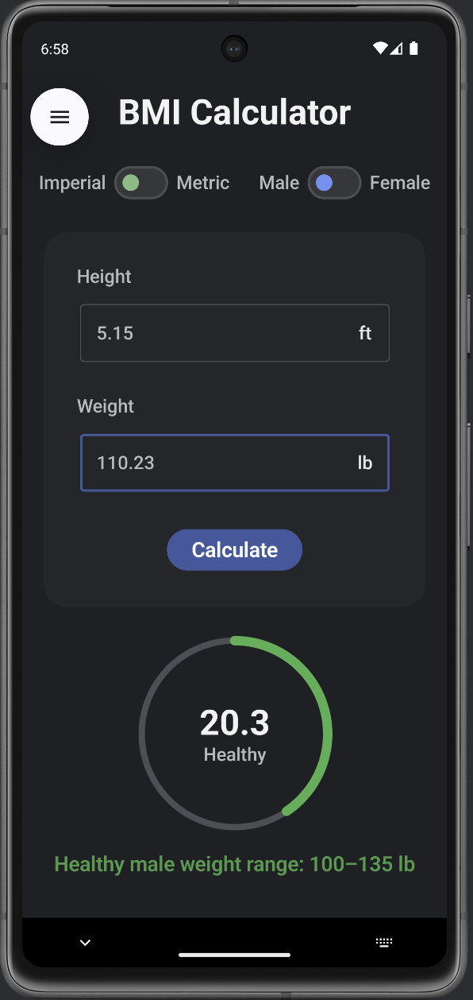
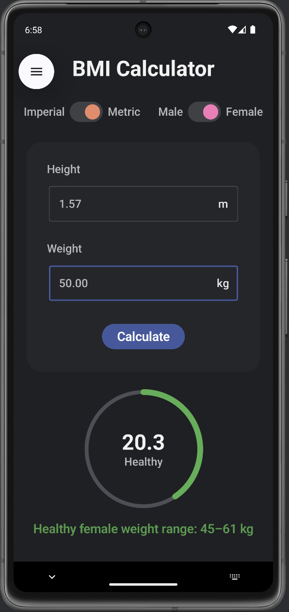
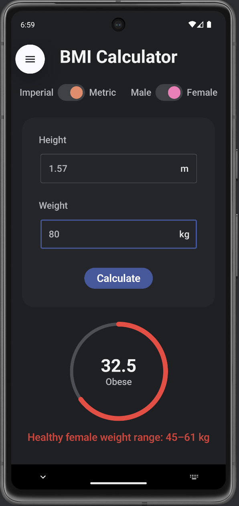
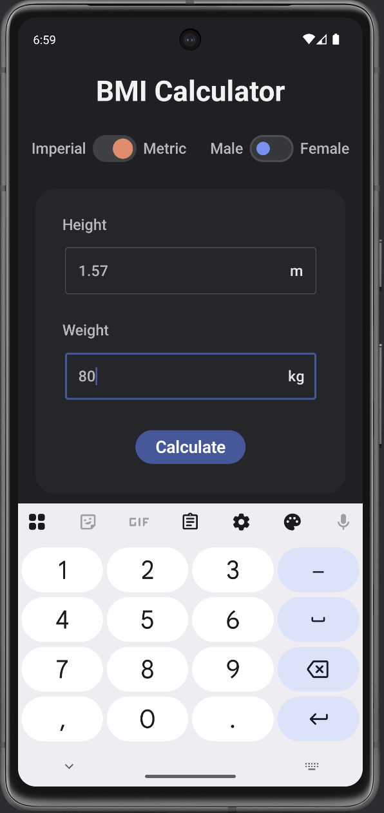

# BMI Calculator (Android)

A simple BMI Calculator app built using **Kotlin** and **Jetpack Compose** in Android Studio.

## Features
- Height & weight input
- Metric and Imperial unit support
- BMI calculation with category (Healthy, Overweight, Obese)
- Clean and modern Compose UI
- On-screen numeric keypad support

## Tech Stack
- Kotlin
- Jetpack Compose
- Android Studio

## Screenshots

  
  
  

  
  
  

